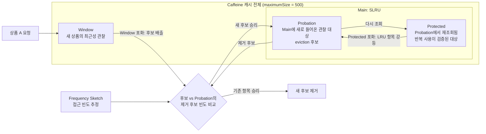

# Caffeine W-TinyLFU 내부 구조 — Window, Probation, Protected, Frequency Sketch

> 날짜: 2026-08-06

## 내용

### W-TinyLFU 전체 구조 — 하나의 캐시를 역할별로 나눈다

`maximumSize(500)`을 설정한 Caffeine 캐시는 상품을 최대 500개까지 보관한다. W-TinyLFU는 이 하나의 캐시 용량 안을 논리적으로 나누어, 새로 들어온 상품·관찰 중인 상품·반복 사용이 검증된 상품을 서로 다르게 다룬다.



| 구성 요소 | 역할 | 판단하는 신호 |
|---|---|---|
| Window | 새 상품에 최근성 기회를 부여 | 최근 접근 시점 |
| Frequency Sketch | 후보의 접근 빈도를 작게 기록·추정 | 접근 빈도 |
| Probation | Main에 막 들어온 상품을 관찰 | 최근 접근 시점 |
| Protected | 재사용이 확인된 상품을 오래 보관 | 최근 접근 시점 |

`Window`, `Probation`, `Protected`는 별도 캐시 서버나 별도 메모리가 아니다. Caffeine 내부의 한 캐시가 eviction 순서를 관리하기 위해 나눈 논리적 영역이며, `Frequency Sketch`는 상품 값 자체가 아니라 접근 빈도를 추정하기 위한 메타데이터다.

> **면접 예상 질문:** Caffeine의 W-TinyLFU에서 Window, Main, Frequency Sketch는 각각 어떤 책임을 가지며, 이들이 별도의 캐시 인스턴스가 아닌 이유는 무엇인가?

---

### Window — 새 상품이 최근성 기회를 얻는 입장 구역

새 상품 A가 처음 조회되면 캐시 miss로 DB를 읽은 뒤 우선 **Window**에 들어간다. Window는 LRU 방식으로 최근에 접근한 상품을 앞쪽에 두므로, 갑자기 조회가 늘어난 상품은 짧은 시간 동안 캐시에 머물며 다시 조회될 기회를 얻는다.

Window가 가득 찬 뒤 새 항목이 들어오면 Window에서 가장 오래 사용되지 않은 항목이 후보(candidate)로 나온다. 이 후보는 즉시 삭제되지 않고 Main에 들어갈 가치가 있는지 다음 단계에서 평가받는다.

```
상품 A 첫 조회 → DB 조회 → Window 저장
상품 A 재조회  → Window 안에서 최근 사용 위치로 이동

Window 포화
  → Window의 LRU 항목을 후보로 선택
  → Probation의 제거 후보와 빈도를 비교
```

Window가 없다면 새 상품은 과거 빈도가 낮다는 이유만으로 즉시 Main 입장을 거절당할 수 있다. 그러면 갑자기 인기를 얻은 상품이 반복 요청돼도 계속 DB를 조회할 수 있으므로, Window는 최근성 burst를 흡수하는 역할을 한다.

> **면접 예상 질문:** 새 항목을 빈도 비교 전에 Window에 먼저 넣는 이유는 무엇이며, Window가 없다면 최근에 인기가 생긴 상품은 어떤 불리함을 겪는가?

---

### Frequency Sketch — 빈도만 추정하고, 최신성은 별도로 관리한다

TinyLFU의 `Frequency Sketch`는 상품마다 정확한 조회 횟수를 끝까지 저장하는 큰 카운터 맵이 아니다. 작은 메모리로 접근 횟수를 **확률적으로 추정**해, Window에서 나온 후보와 Main의 제거 후보 중 어느 쪽이 더 자주 쓰였는지 비교한다.

중요한 구분은 다음과 같다.

| 구분 | 담당 구성 요소 | 의미 |
|---|---|---|
| 접근 빈도 | Frequency Sketch | 과거에 몇 번 접근됐는지의 추정치 |
| 최신성 | Window·Probation·Protected의 LRU 순서 | 마지막 접근이 얼마나 최근인지 |

따라서 "추정 빈도"가 최신성과 빈도를 합친 점수는 아니다. 오래전의 인기만 영원히 유리해지지 않도록 Frequency Sketch의 카운터는 주기적으로 감쇠(aging)되어, 최근 트래픽 변화가 비교 결과에 반영되도록 한다.

빈도 비교의 결과는 입장(admission)을 결정한다.

```
Window 후보 A의 추정 빈도 > Probation 제거 후보 B의 추정 빈도
  → A를 Probation에 넣고 B를 eviction

Window 후보 A의 추정 빈도 ≤ Probation 제거 후보 B의 추정 빈도
  → A를 캐시에서 제거하고 B 유지
```

이 과정 덕분에 한 번만 조회된 상품은 Main을 쉽게 오염시키지 못하고, 꾸준히 조회된 상품은 캐시에 남을 가능성이 높아진다.

> **면접 예상 질문:** Frequency Sketch가 정확한 카운터 대신 빈도를 추정하는 이유는 무엇이며, 빈도와 최신성은 W-TinyLFU에서 어떻게 분리되어 관리되는가?

---

### Probation과 Protected — Main에서 재사용을 검증하는 SLRU

Main은 SLRU(Segmented LRU)로 동작하며, `Probation`과 `Protected` 두 영역으로 나뉜다. Window에서 나온 후보가 빈도 경쟁에서 이기면 먼저 **Probation**에 들어간다. Probation은 "한 번 Main에 들어왔지만 정말 다시 쓰일까?"를 관찰하는 구역이다.

Probation에 있는 상품이 한 번 더 조회되면, 재사용이 확인됐다는 신호로 **Protected**로 승격된다. Protected는 더 오래 보관할 가치가 검증된 상품을 위한 영역이다.

| 상황 | 이동 | 의도 |
|---|---|---|
| Window 후보가 빈도 경쟁 승리 | Window → Probation | Main 입장 후 재사용 관찰 |
| Probation 상품 재조회 | Probation → Protected | 반복 사용 확인 |
| Protected가 가득 참 | Protected의 LRU → Probation | 즉시 삭제하지 않고 재관찰 |
| Probation이 가득 찬 상태에서 후보 경쟁 패배 | Probation의 LRU 항목 eviction | 덜 가치 있는 항목 제거 |

Protected가 가득 찼다고 바로 항목을 삭제하지 않고 Probation으로 내리는 이유는, 잠시 요청이 뜸해졌을 뿐 다시 사용될 수 있기 때문이다. 이렇게 한 번 더 관찰한 뒤에도 재사용되지 않는 항목이 eviction 후보가 된다.

```
Probation 상품 재조회
  → Protected로 승격

Protected 포화
  → Protected의 LRU 상품을 Probation으로 강등
  → Probation에서도 오래 재사용되지 않으면 eviction 후보가 됨
```

> **면접 예상 질문:** Main을 Probation과 Protected로 나누는 이유는 무엇이며, Protected가 가득 찼을 때 즉시 eviction하지 않고 Probation으로 강등하는 이유는 무엇인가?

---

### 상품 A의 전체 여정 — miss부터 eviction과 재조회까지

대출 상품 A를 예로 들면 W-TinyLFU의 흐름은 다음과 같다.

1. 상품 A의 첫 요청은 캐시 miss다. `LoadingCache`는 DB에서 A를 읽어 Window에 저장한다.
2. Window가 포화되면 가장 오래 사용되지 않은 Window 항목이 후보가 된다.
3. 후보 A는 Probation에서 가장 오래 사용되지 않은 제거 후보와 Frequency Sketch의 추정 빈도를 비교한다.
4. A의 빈도가 더 높으면 A는 Probation에 들어가고 기존 후보는 eviction된다. 반대면 A가 제거된다.
5. Probation의 A가 다시 조회되면 Protected로 승격된다.
6. 이후 Protected에서 밀려난 A는 Probation으로 한 번 내려와 재사용 기회를 더 얻을 수 있다. 다시 사용되지 않고 경쟁에서 지면 캐시에서 제거된다.
7. 제거된 A가 다시 요청되면 캐시 miss가 발생해 `LoadingCache`가 DB에서 다시 읽는다.

`maximumSize`가 작아 eviction이 자주 발생하면, 반복 조회될 상품도 캐시에 남지 못해 DB 접근이 늘어난다. 따라서 캐시 크기·TTL을 조정할 때는 hit rate뿐 아니라 SIZE eviction과 EXPIRED eviction의 원인을 함께 관찰해야 한다.

> **면접 예상 질문:** `maximumSize`가 너무 작아 eviction이 자주 발생하면 상품 조회 API의 DB 부하와 응답 시간에 어떤 영향을 주며, 어떤 지표로 이를 확인하겠는가?

---

## 학습 정리

- W-TinyLFU는 하나의 Caffeine 캐시 안에서 Window·Main·Frequency Sketch가 각자 다른 책임을 맡는 정책이다.
- Window는 새 상품의 최근성 burst를 관찰하고, Frequency Sketch는 후보와 제거 후보의 접근 빈도를 비교해 Main 입장을 결정한다.
- Frequency Sketch의 빈도와 LRU 영역이 관리하는 최신성은 서로 다른 신호다. 오래된 빈도는 감쇠해 최근 트래픽 변화도 반영한다.
- Main의 Probation은 재사용을 관찰하는 구역이고, 재조회된 항목은 Protected로 승격된다. Protected가 차면 즉시 삭제하지 않고 Probation으로 강등한다.
- eviction된 상품은 다음 요청에서 cache miss가 되어 DB를 다시 조회하므로, hit rate와 eviction 원인을 함께 보며 `maximumSize`와 TTL을 조정해야 한다.

## 참고

- [Caffeine Efficiency — W-TinyLFU](https://github.com/ben-manes/caffeine/wiki/Efficiency)
